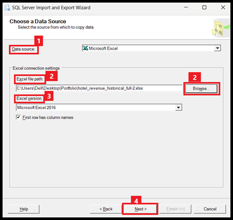

# How to Build a Data Analyst Portfolio?

In this tutorial, we will follow the steps to build the best portfolio as a data analyst:

- Create a Database
- Query and analyze data with SQL
- Integrate Power BI with a Database
- Create Data Visualizations Using Power BI

## 1. Create a Database
Let’s start by creating a database in SSMS (SQL Server Management Studio) for further analysis of Hotel Booking Data. Find all the data you need here.

We will create a database by following these steps:

1. Open SQL Server Management Studio and you will see a new window on your screen.
2. Copy the Server Name for later use, then click on Connect.
3. Now, on the SSMS window, you will see the following options:
   - Right-click on Databases and select New Database from the dropdown.
4. Assign a Database Name in the New Database window and click OK.
5. Expand the Databases, and you can see the `Project` database is created.
6. In the Databases pane, right-click the `Project` database and select `Import Data` from the `Task` dropdown list.
7. In the Import Data dialog box, select the data source that you want to import from.
   - Browse data file or enter the path.
   - Choose the Excel version you want to use and click Next.
  
     



> **Note**: If you face an error, download Microsoft Access Database Engine 2016.

8. Select a destination and verify the server and database name.
9. Select tables that you want to import.
10. Now, when you run it, you will see that all the data is imported into the environment.
11. You can then view the data in the `Project` database by expanding the Tables node in the Databases pane.

## 2. Querying Data

We have now prepared our data tables in the database for SQL commands. Let’s apply some SQL commands to explore the data.

### Fetching Data from Tables
To fetch data from the tables, we will use the following SQL command. The wildcard `*` operator retrieves all the data from the table.

```sql
SELECT * FROM dbo.['2018$'];
SELECT * FROM dbo.['2019$'];
SELECT * FROM dbo.['2020$'];


Combining the Data
To combine the data from the three tables, we use the UNION operator:

SELECT * FROM dbo.['2018$']
UNION
SELECT * FROM dbo.['2019$']
UNION
SELECT * FROM dbo.['2020$'];


3. Exploratory Data Analysis (EDA)
Now, we will apply EDA on the data and try to answer the following questions:

Is our hotel revenue growing yearly?
Should we increase our parking lot size?
What trends can we observe in the data?
First, we create a single temporary table hotels that combines all the data:

WITH hotels AS (
  SELECT * FROM dbo.['2018$']
  UNION
  SELECT * FROM dbo.['2019$']
  UNION
  SELECT * FROM dbo.['2020$']
)

SELECT * FROM hotels;


Q1: Is our hotel revenue growing yearly?
We create a new column revenue by using the data from the adr (Average Daily Rate), stays_in_week_nights, and stays_in_weekend_nights columns:

SELECT 
  (stays_in_week_nights + stays_in_weekend_nights) * adr AS revenue 
FROM hotels;


We also add arrival_date_year and group the data by year:

SELECT 
  arrival_date_year,
  SUM((stays_in_week_nights + stays_in_weekend_nights) * adr) AS revenue 
FROM hotels 
GROUP BY arrival_date_year;


Next, we group the data by hotel to see which hotel generated the most revenue:

SELECT 
  arrival_date_year, 
  hotel,
  SUM((stays_in_week_nights + stays_in_weekend_nights) * adr) AS revenue 
FROM hotels 
GROUP BY arrival_date_year, hotel;


Q2: Revenue by hotel type


Q3: The number of adults and children by hotel


4. Create Data Visualizations Using Power BI
Preprocess Columns
We need to preprocess some columns using SQL. Perform two LEFT JOIN queries:

Join the hotels table with market_segment$ using the market_segment column.
Join the hotels table with meal_cost$ using the meal column.

WITH hotels AS (
  SELECT * FROM dbo.['2018$']
  UNION
  SELECT * FROM dbo.['2019$']
  UNION
  SELECT * FROM dbo.['2020$']
)

SELECT * FROM hotels
LEFT JOIN dbo.market_segment$ ON hotels.market_segment = market_segment$.market_segment
LEFT JOIN dbo.meal_cost$ ON meal_cost$.meal = hotels.meal;


Connect Power BI to SQL Server
Open Power BI and click on Get Data.
Select SQL Server.
In the SQL Server Database window:
Enter the server’s name and database name.
Paste the following code in the SQL text field:

WITH hotels AS (
  SELECT * FROM dbo.['2018$']
  UNION
  SELECT * FROM dbo.['2019$']
  UNION
  SELECT * FROM dbo.['2020$']
)

SELECT * FROM hotels
LEFT JOIN dbo.market_segment$ ON hotels.market_segment = market_segment$.market_segment
LEFT JOIN dbo.meal_cost$ ON meal_cost$.meal = hotels.meal;


Hit the Load button to load the data.
Q4: What trends can we observe in the data?
We created some visuals using Power BI. A few trends include:

Revenue increased from 2018 to 2019 but decreased in 2020.
The Average Daily Rate (ADR) increased from 2019 to 2020.
Total nights booked by customers decreased from 2019 to 2020.
Discounts offered by the hotel increased from 2019 to 2020.


Conclusion
In this tutorial, we covered the following topics:

How to create and manage a database.
Write SQL queries for data exploration.
Perform EDA to analyze the data.
Connect to Power BI for data visualization.
We also answered some key questions about hotel data.
